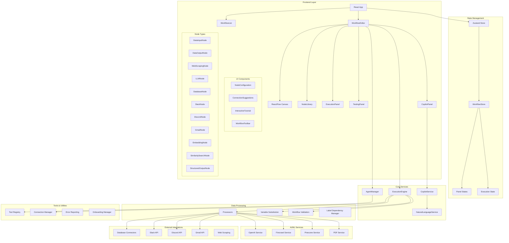
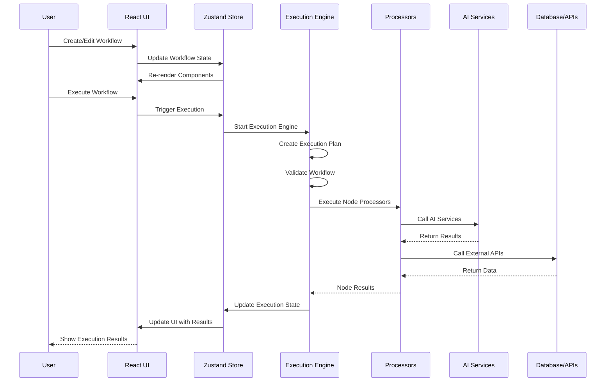

# Workflow Builder Architecture Diagram

## High-Level System Architecture

## Detailed Component Architecture

```mermaid
graph TB
    subgraph "Frontend Architecture"
        subgraph "App Layer"
            A1[App.tsx] --> A2[WorkflowList]
            A1 --> A3[WorkflowEditor]
            A3 --> A4[ReactFlowProvider]
        end

        subgraph "Editor Components"
            B1[WorkflowEditor] --> B2[NodeLibrary]
            B1 --> B3[WorkflowToolbar]
            B1 --> B4[ReactFlow Canvas]
            B1 --> B5[ExecutionPanel]
            B1 --> B6[TestingPanel]
            B1 --> B7[CopilotPanel]
        end

        subgraph "Node System"
            C1[BaseNode] --> C2[DataInputNode]
            C1 --> C3[DataOutputNode]
            C1 --> C4[WebScrapingNode]
            C1 --> C5[LLMNode]
            C1 --> C6[DatabaseNode]
            C1 --> C7[SlackNode]
            C1 --> C8[DiscordNode]
            C1 --> C9[GmailNode]
            C1 --> C10[EmbeddingNode]
            C1 --> C11[SimilaritySearchNode]
            C1 --> C12[StructuredOutputNode]
        end

        subgraph "Configuration & UI"
            D1[NodeConfiguration]
            D2[ConnectionSuggestions]
            D3[ConnectionValidation]
            D4[InteractiveTutorial]
            D5[OnboardingModal]
        end
    end

    subgraph "State Management (Zustand)"
        E1[WorkflowStore] --> E2[Workflow Management]
        E1 --> E3[Node Management]
        E1 --> E4[Edge Management]
        E1 --> E5[Execution State]
        E1 --> E6[Panel States]
        E1 --> E7[Copilot Methods]
    end

    subgraph "Core Execution Engine"
        F1[ExecutionEngine] --> F2[ExecutionPlan]
        F1 --> F3[ExecutionContext]
        F1 --> F4[Sequential Execution]
        F1 --> F5[Parallel Execution]
        F1 --> F6[Conditional Execution]
        F1 --> F7[Validation]
        F1 --> F8[Error Handling]
    end

    subgraph "AI Agent System"
        G1[AgentManager] --> G2[WorkflowAgent]
        G1 --> G3[Tool Registry]
        G2 --> G4[ClassifyIntentTool]
        G2 --> G5[ExtractEntitiesTool]
        G2 --> G6[GenerateWorkflowTool]
        G2 --> G7[ValidateWorkflowTool]
        G2 --> G8[CacheLookupTool]
        G2 --> G9[GenerateSuggestionsTool]
    end

    subgraph "Service Layer"
        H1[CopilotService] --> H2[NaturalLanguageService]
        H3[DatabaseConnectionManager] --> H4[UnifiedDatabaseService]
        H5[OpenAIService]
        H6[FirecrawlService]
        H7[PineconeService]
        H8[PDFService]
        H9[SlackService]
        H10[DiscordService]
        H11[GmailService]
    end

    subgraph "Data Processing"
        I1[Processors] --> I2[DataInputProcessor]
        I1 --> I3[DataOutputProcessor]
        I1 --> I4[WebScrapingProcessor]
        I1 --> I5[LLMProcessor]
        I1 --> I6[DatabaseProcessor]
        I1 --> I7[SlackProcessor]
        I1 --> I8[DiscordProcessor]
        I1 --> I9[GmailProcessor]
        I1 --> I10[EmbeddingProcessor]
        I1 --> I11[SimilarityProcessor]
        I1 --> I12[StructuredOutputProcessor]
    end

    subgraph "Database Connectors"
        J1[BaseConnector] --> J2[PostgresConnector]
        J1 --> J3[MySQLConnector]
        J1 --> J4[MongoConnector]
    end

    subgraph "Utilities & Tools"
        K1[VariableSubstitution]
        K2[WorkflowValidator]
        K3[LabelDependencyManager]
        K4[ConnectionSuggestions]
        K5[ErrorReporting]
        K6[OnboardingManager]
        K7[TutorialManager]
        K8[WorkflowGenerator]
        K9[WorkflowSerialization]
    end

    %% Data Flow
    A3 --> E1
    E1 --> F1
    F1 --> I1
    I1 --> H5
    I1 --> H6
    I1 --> H7
    I1 --> H8
    I1 --> H9
    I1 --> H10
    I1 --> H11
    I1 --> J2
    I1 --> J3
    I1 --> J4
    B7 --> G1
    G1 --> H1
    F1 --> K1
    F1 --> K2
    E1 --> K3
```

## Data Flow Architecture

## Technology Stack

### Frontend

- **React 18** - UI Framework
- **TypeScript** - Type Safety
- **ReactFlow** - Workflow Canvas
- **Zustand** - State Management
- **Tailwind CSS** - Styling
- **Radix UI** - Component Library
- **Lucide React** - Icons

### Backend Services

- **OpenAI API** - LLM Processing
- **Firecrawl** - Web Scraping
- **Pinecone** - Vector Database
- **Database Connectors** - PostgreSQL, MySQL, MongoDB

### External Integrations

- **Slack API** - Messaging
- **Discord API** - Gaming Communication
- **Gmail API** - Email Processing
- **Various Web APIs** - Data Sources

### Development Tools

- **Jest** - Testing Framework
- **React Testing Library** - Component Testing
- **ESLint** - Code Linting
- **PostCSS** - CSS Processing
- **Webpack** - Module Bundling

## Key Features

1. **Visual Workflow Builder** - Drag-and-drop interface for creating workflows
2. **AI-Powered Generation** - Natural language to workflow conversion
3. **Multiple Node Types** - Data processing, AI, database, and integration nodes
4. **Execution Engine** - Sequential, parallel, and conditional execution modes
5. **Real-time Validation** - Workflow validation and error handling
6. **Variable Substitution** - Dynamic data flow between nodes
7. **External Integrations** - Database, messaging, and web service connections
8. **Interactive Tutorials** - Onboarding and learning system
9. **Connection Suggestions** - AI-powered workflow optimization
10. **Execution Monitoring** - Real-time execution status and results

## Architecture Principles

1. **Modular Design** - Loosely coupled components with clear interfaces
2. **Type Safety** - Comprehensive TypeScript usage throughout
3. **State Management** - Centralized state with Zustand
4. **Plugin Architecture** - Extensible node and processor system
5. **Error Handling** - Comprehensive error reporting and recovery
6. **Performance** - Optimized rendering and execution
7. **Accessibility** - WCAG compliant UI components
8. **Testing** - Comprehensive test coverage
9. **Documentation** - Well-documented APIs and components
10. **Scalability** - Designed for growth and extension
